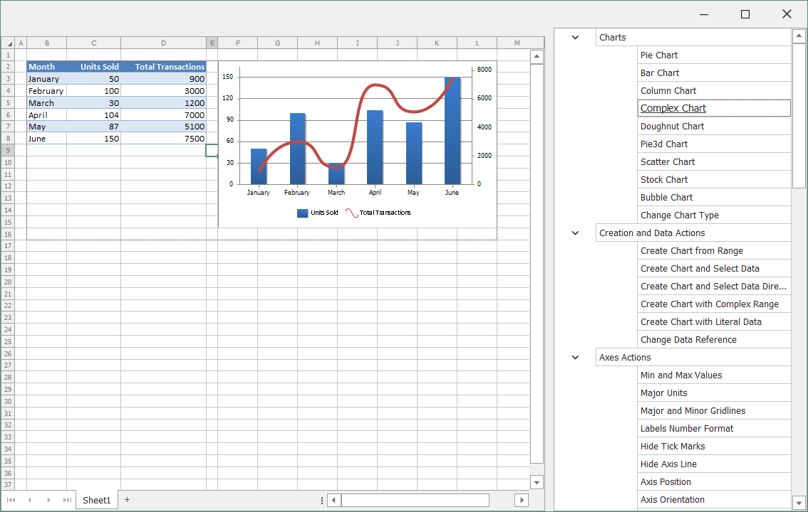

<!-- default badges list -->

<!-- default badges end -->

# WinForms Spreadsheet Chart API

This example demonstrates how to use the SpreadsheetControl Chart API to programmatically manage charts in worksheets.

The application includes the **TreeList** that contains all available actions, and the **SpreadsheetControl** that shows the result of code execution. Click on the required action in the TreeList to view the result.

## Files to Review

* [AxesActions.cs](./CS/SpreadsheetChartAPISamples/CodeExamples/AxesActions.cs) (VB: [AxesActions.vb](./VB/SpreadsheetChartAPISamples/CodeExamples/AxesActions.vb))
* [Charts.cs](./CS/SpreadsheetChartAPISamples/CodeExamples/Charts.cs) (VB: [Charts.vb](./VB/SpreadsheetChartAPISamples/CodeExamples/Charts.vb))
* [ChartSheetActions.cs](./CS/SpreadsheetChartAPISamples/CodeExamples/ChartSheetActions.cs) (VB: [ChartSheetActions.vb](./VB/SpreadsheetChartAPISamples/CodeExamples/ChartSheetActions.vb))
* [CreationAndDataActions.cs](./CS/SpreadsheetChartAPISamples/CodeExamples/CreationAndDataActions.cs) (VB: [CreationAndDataActions.vb](./VB/SpreadsheetChartAPISamples/CodeExamples/CreationAndDataActions.vb))
* [DataLabelsActions.cs](./CS/SpreadsheetChartAPISamples/CodeExamples/DataLabelsActions.cs) (VB: [DataLabelsActions.vb](./VB/SpreadsheetChartAPISamples/CodeExamples/DataLabelsActions.vb))
* [LegendActions.cs](./CS/SpreadsheetChartAPISamples/CodeExamples/LegendActions.cs) (VB: [LegendActions.vb](./VB/SpreadsheetChartAPISamples/CodeExamples/LegendActions.vb))
* [Protection.cs](./CS/SpreadsheetChartAPISamples/CodeExamples/Protection.cs) (VB: [Protection.vb](./VB/SpreadsheetChartAPISamples/CodeExamples/Protection.vb))
* [SeriesActions.cs](./CS/SpreadsheetChartAPISamples/CodeExamples/SeriesActions.cs) (VB: [SeriesActions.vb](./VB/SpreadsheetChartAPISamples/CodeExamples/SeriesActions.vb))
* [StyleActions.cs](./CS/SpreadsheetChartAPISamples/CodeExamples/StyleActions.cs) (VB: [StyleActions.vb](./VB/SpreadsheetChartAPISamples/CodeExamples/StyleActions.vb))
* [TitlesActions.cs](./CS/SpreadsheetChartAPISamples/CodeExamples/TitlesActions.cs) (VB: [TitlesActions.vb](./VB/SpreadsheetChartAPISamples/CodeExamples/TitlesActions.vb))
* [ViewOptionsActions.cs](./CS/SpreadsheetChartAPISamples/CodeExamples/ViewOptionsActions.cs) (VB: [ViewOptionsActions.vb](./VB/SpreadsheetChartAPISamples/CodeExamples/ViewOptionsActions.vb))
* [TrendlineActions.cs](./CS/SpreadsheetChartAPISamples/CodeExamples/TrendlineActions.cs) (VB: [TrendlineActions.vb](./VB/SpreadsheetChartAPISamples/CodeExamples/TrendlineActions.vb))
* [DataTableActions.cs](./CS/SpreadsheetChartAPISamples/CodeExamples/DataTableActions.cs) (VB: [DataTableActions.vb](./VB/SpreadsheetChartAPISamples/CodeExamples/DataTableActions.vb))

## Documentation

* [Spreadsheet Chart Overview](https://docs.devexpress.com/WindowsForms/16437/controls-and-libraries/spreadsheet/charts-and-graphics/charting-overview)
* [Spreadsheet Chart Examples](https://docs.devexpress.com/WindowsForms/17093/controls-and-libraries/spreadsheet/examples/charts)
<!-- feedback -->
## Does this example address your development requirements/objectives?

 

(you will be redirected to DevExpress.com to submit your response)
<!-- feedback end -->
